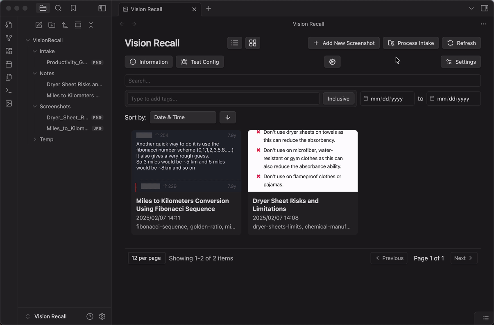

# Vision Recall — Screenshot Knowledge Base for Obsidian

	
	
	
	
	
	

<h1 align="center">Screenshot anything you want to recall later. Let AI handle the rest.</h1>

## Features

- **📸 Automatic Screenshot Intake:**

  - 📂 **Intake Folder Monitoring:** Automatically process screenshots as soon as they are added to your designated intake folder.
  - ⏱️ **Periodic & Auto-Processing:** Options for periodic intake folder checks or instant processing upon file creation.
  - 🔗 **Deep Link Intake:** Capture screenshots directly via Obsidian deep links (for advanced workflows).
  - 📋 **Clipboard Upload:** Quickly process screenshots directly from your clipboard.
  - 📤 **File Upload Modal:** Easily upload and process screenshots from files in your vault.

- **🧠 AI-Powered Screenshot Analysis:**

  - 👓 **Optical Character Recognition (OCR):** Extract text from images with Tesseract OCR.
  - 👁️ **Vision LLM Integration:** Leverage powerful Vision Language Models (like OpenAI's GPT-4o or Ollama models) to analyze image content and understand the context.
  - 📝 **Intelligent Note Generation:** Automatically generate insightful Obsidian notes summarizing the key information from your screenshots, combining OCR text and vision analysis.
  - 🏷️ **Smart Tagging:** AI-suggested tags automatically categorize your screenshots, making them easily searchable and linkable.

- **🗂️ Organize & Recall Your Visual Knowledge:**

  - 🖼️ **Gallery & List Views:** Browse and manage your screenshots in visually appealing gallery or detailed list views within Obsidian.
  - 🔍 **Powerful Filtering & Search:** Quickly find screenshots using text search, tag filters, and date range filters.
  - 🏷️ **Tag Management:** Easily edit and manage tags for your screenshots to refine your knowledge organization.
  - 🔗 **Obsidian Note Linking:** Seamlessly link back to your original screenshots from generated notes and vice versa.
  - 📊 **Metadata Rich:** View and edit detailed metadata for each screenshot, including OCR text, vision analysis, generated notes, and extracted tags.

- **⚙️ Customizable & User-Friendly:**
  - 🎛️ **Comprehensive Settings:** Fine-tune LLM providers, storage folders, output note settings, and more through a detailed settings tab.
  - 🚦 **Processing Queue Management:** Monitor and control screenshot processing with a built-in queue, allowing you to pause, resume, and stop processing as needed.
  - 📊 **Status Bar Integration:** Quickly access processing queue status and controls from the Obsidian status bar.
  - 🧑‍💻 **Debug Mode:** Detailed logging for troubleshooting and development.

## Installation

1. Open Obsidian
2. Go to **Settings** → **Community Plugins**
3. Search for **Vision Recall**
4. Click **Install** and then **Enable**

### Setup

1.  **Open Vision Recall Settings:** After enabling the plugin, a "Vision Recall" settings tab will appear in your Obsidian settings.
2.  **Configure LLM Provider:** Choose your preferred LLM provider (OpenAI or Ollama) and enter your API key (if using OpenAI or OpenRouter). Configure the API Base URL if needed (e.g., for Ollama or custom OpenAI-compatible endpoints).
3.  **Set up Storage Folders:** Configure your screenshot storage, intake, and output notes folders within your Obsidian vault in the settings tab. Vision Recall can automatically create these folders for you if they don't exist.
4.  **Start Processing Screenshots!** You can now:
    - **Drop screenshots into your intake folder** for automatic processing.
    - **Use the "Add New Screenshot" command** to upload files or paste from clipboard.
    - **Open the Vision Recall View** (using the ribbon icon or command) to manage and browse your screenshots.

### Basic Usage

- **Processing Screenshots:** Vision Recall will automatically process screenshots in your intake folder or those you upload via the plugin's UI.
- **Viewing Screenshots:** Open the "Vision Recall View" to browse your processed screenshots in gallery or list mode.
- **Opening Notes:** Click on a screenshot in the Vision Recall View to open its generated Obsidian note, containing summaries, OCR text, vision analysis, and tags.
- **Editing Metadata:** Edit tags and other metadata directly from the Vision Recall View.
- **Managing Processing Queue:** Use the Processing Queue modal (accessible from the status bar button or commands) to monitor and control screenshot processing.

